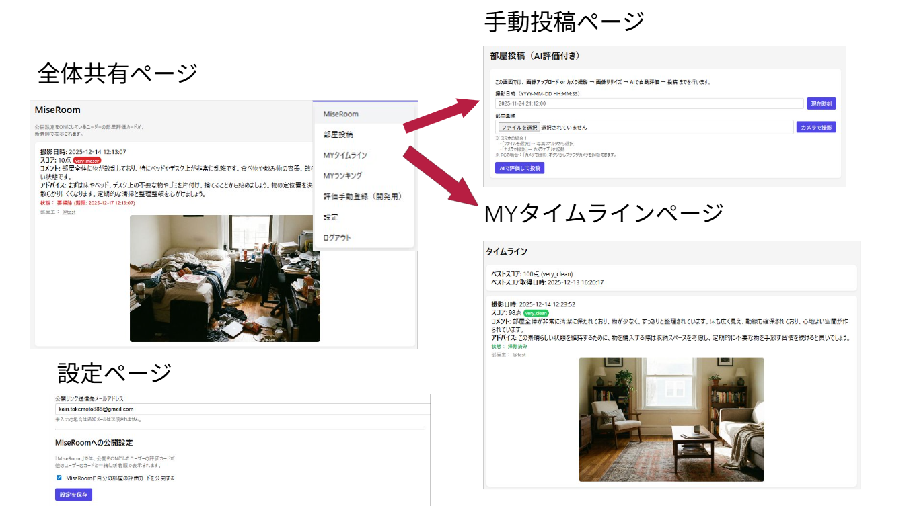
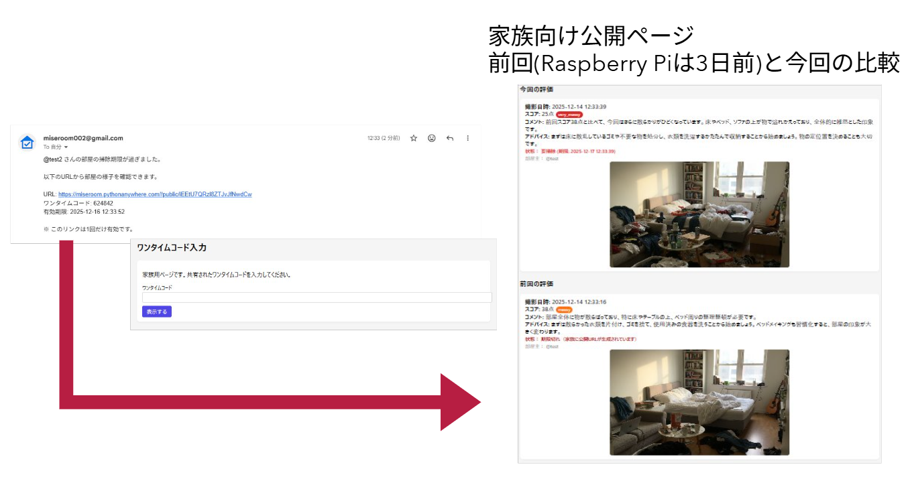
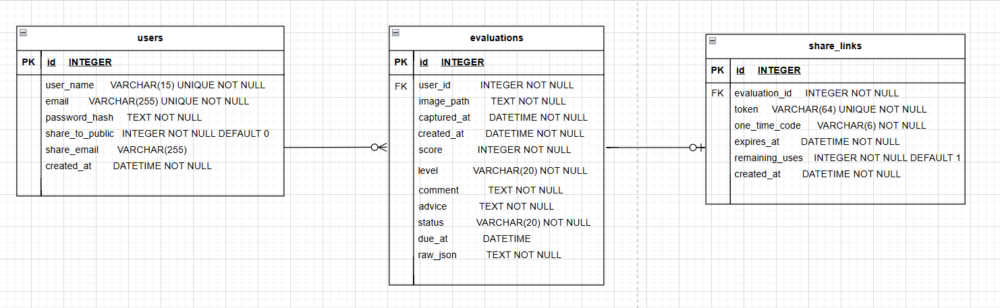

# MiseRoom

**Web×IoT メイカーズチャレンジ PLUS in 愛媛 特別賞 受賞作品**

> **AIが部屋の状態を見える化し、片付け行動を後押しする掃除支援アプリ**

MiseRoomは、部屋の写真をもとにAIが綺麗さを評価し、改善アドバイスを提示する **掃除支援Webアプリ**です。  
Raspberry Piと人感センサを用いて、**無人時に部屋を自動撮影・評価し、在室時には音声で掃除を促す**仕組みを実装しました。  

また、Web上からも画像アップロードやカメラ撮影による評価が可能で、評価結果はタイムラインで可視化されます。  
さらに、他ユーザーの部屋評価を閲覧できる共有機能や、スコアが低い状態が続いた場合に **公開リンク付きで家族へ通知する機能**も備えています。

## チーム構成

- **ラズパイ班**：2人（大学院生）
- **Web班**：1人（私）
- **工作班**：1人（高校生）

## URL
- **URL:** [https://miseroom.pythonanywhere.com](https://miseroom.pythonanywhere.com)
- **テストユーザー:** メールアドレス: sample@example.com / パスワード: sample12345

## デモ

### メインWebページ

### 公開URL

### Raspberry PI 連携
- [掃除ができている場合](https://youtu.be/rnVtDIIxRHU?si=P50eqEm6ThfuqVTe)
- [掃除ができていない場合](https://youtu.be/EgJPxA4oc5k?si=2Ms32gRLC4kW7Yr7)

## 主な機能

**認証・ユーザー管理**  
- 新規登録、ログイン / ログアウト、ユーザー情報変更、公開設定切り替え、公開リンク送信先メールアドレス設定、アカウント削除に対応。

**部屋投稿（AI評価）**  
- 部屋画像をアップロードまたはカメラ撮影して投稿でき、画像はサーバー側でリサイズ後、Gemini API により自動評価される。

**Raspberry Pi連携**  
- Raspberry Piから画像をAPI経由で送信し、Web投稿と同じAI評価・保存フローで処理できる。

**MYタイムライン / MYランキング**  
- 自分の評価履歴を時系列で確認でき、ベストスコアの表示や、上位5件・最低スコア1件のランキング表示にも対応。

**みんなの部屋 / 公開タイムライン**  
- 公開設定をONにしたユーザーの評価を一覧表示し、他ユーザーの公開タイムラインを閲覧できる。

**公開URL・メール通知機能**  
- 低スコア状態が続いた場合に公開URLを生成し、ワンタイムコード付きで家族などにメール通知できる。

## 使用技術

### フロントエンド

- HTML
- CSS
- JavaScript
- Alpine.js

### バックエンド

- Python 3.12
- Flask 3.0.0

### データベース

- SQLite

### テンプレートエンジン

- Jinja2 3.1.2

### ライブラリ・外部サービス

- Pillow 10.0.0
- python-dotenv
- Google Gemini API
- Gmail SMTP / smtplib

### 実行環境

- PythonAnywhere
- Raspberry Pi

## ER図

## 開発における生成AIの活用と今後の課題

本作品の開発では、生成AIを活用しながら実装を進めました。  
特に、Webアプリケーションの各機能のコード作成に活用しました。
一方で、課題設定、機能企画、画面や体験の方向性の検討、機能同士のつながりの整理、動作確認や修正方針の判断は自分で行いました。  
単にコードを生成するだけではなく、作品として成立させるために必要な仕様の整理や調整を繰り返しながら開発を進めました。
この開発を通じて、生成AIを使うことで素早く形にできる一方で、自分自身の実装理解や設計の甘さに気づく場面も多くありました。  
そのため今後は、AIを活用しながらも、実装内容を自分で理解し、必要に応じて修正・改善できる力を高めていきたいと考えています。
