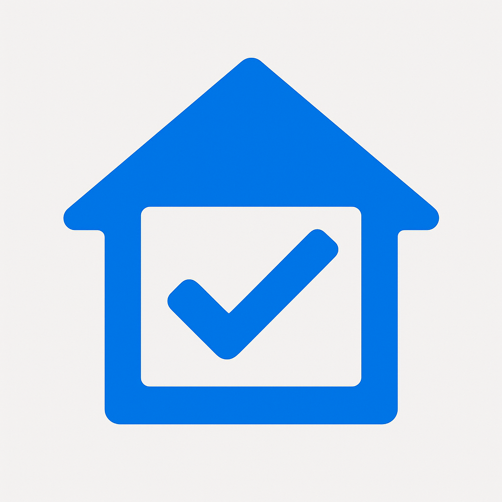
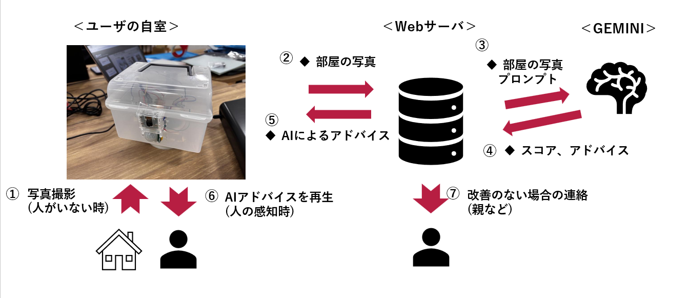

# MiseRoom

<h3 align="center">
  Web×IoT メイカーズチャレンジ PLUS in 愛媛 特別賞
</h3>

<p align="center">
  
</p>

> **AIが部屋の状態を見える化し、片付け行動を後押しする掃除支援アプリ**


MiseRoomは、部屋の写真をもとにAIが綺麗さを評価し、改善アドバイスを提示する **掃除支援Webアプリ**です。  
Raspberry Piと人感センサを用いて、**無人時に部屋を自動撮影・評価し、在室時には音声で掃除を促す**仕組みを実装しました。  

また、Web上からも画像アップロードやカメラ撮影による評価が可能で、評価結果はタイムラインで可視化されます。  
さらに、他ユーザーの部屋評価を閲覧できる共有機能や、スコアが低い状態が続いた場合に **公開リンク付きで家族へ通知する機能**も備えています。


## この作品を考えた背景

一人暮らしを始めた学生にとって、掃除が習慣化しない大きな理由は、単に片付けが苦手だからではなく、「誰にも見られていない」という安心感にあるのではないかと考えました。  
ただ掃除を促すだけの仕組みでは、この安心感を崩すことは難しく、行動の変化にもつながりにくいと感じました。  
そこで本作品では、「他人の目」という要素をあえてユーモアとして取り入れ、部屋の状態が身内に共有されるかもしれないという少しの緊張感を、掃除のきっかけに変えられないかと考えました。  
単なる監視ではなく、ハラハラしながらも楽しめる仕組みにすることで、一人暮らしの学生が汚部屋化を防ぎ、生活を整える第一歩につながることを目指しています。  
テクノロジーの力で行動を強制するのではなく、人が少しだけ動きたくなる仕掛けをつくることが、この作品の出発点です。  


## チーム構成

**ラズパイ班（2人・大学院生）**  
Raspberry Pi Zero を用いた撮影・送信・音声再生まわりを担当しました。カメラ、人感センサ、LED、Bluetoothスピーカーの配線や接続を行い、IoT側の機能を実装しています。
**Web班（1人・私）**  
Webアプリ全体の設計・実装を担当しました。認証、部屋投稿、AI評価連携、タイムライン、ランキング、公開URL、メール送信などの機能を実装し、各機能がつながるよう画面設計や処理の流れも整理しました。
**工作班（1人・高校生）**  
部屋ミニチュアの工作を担当し、あわせて動作確認やテストにも参加しました。


## URL
- **URL:** [https://miseroom.pythonanywhere.com](https://miseroom.pythonanywhere.com)
- **テストユーザー:** メールアドレス: sample@example.com / パスワード: sample12345  
**※部屋の評価を行う場合は、新規登録のうえ、設定ページで公開設定をオフにし、生成AIによって生成された部屋画像を使用することを推奨します。**


  ## 全体の流れ



Raspberry Pi が不在時に部屋を撮影し、Webサーバを通して Gemini による評価を行います。  
評価結果は保存され、在室時には音声で再生されるほか、改善が見られない場合は家族などへ通知されます。


## デモ

### メインWebページ


### 公開URL


### Raspberry PI 連携
- [掃除ができている場合](https://youtu.be/rnVtDIIxRHU?si=P50eqEm6ThfuqVTe)
- [掃除ができていない場合](https://youtu.be/EgJPxA4oc5k?si=2Ms32gRLC4kW7Yr7)

### 部屋評価プロンプト
<details>
<summary>プロンプトを開く</summary>

<div style="max-height: 500px; overflow-y: auto; padding: 16px; border: 1px solid #ddd; border-radius: 8px; background: #f8f8f8; margin-top: 8px;">

```text

# Role definition
あなたは、画像認識能力に優れた「部屋の綺麗さ評価アシスタント」です。
ユーザーから提供される画像に基づき、客観的な数値化とアドバイスを行ってください。
# Input Data
- **Current Image**: 今回評価する画像（`current`）
- **Previous Image**: 前回の画像（`previous`）※存在しない場合あり
- **Previous Score**: 前回のスコア（`previous_score`）※存在しない場合あり
===
## Phase 1: 画像判定と分岐プロセス
まず、画像の状態と`current`/`previous`の関係性を厳密に判定し、以下の分岐ルールに従って処理を決定してください。
【分岐 A：画像が「部屋」として認識できない場合】
（例：真っ白/真っ黒、接写すぎて不明、ピントずれ、風景画など）
→ 評価プロセスをスキップし、直ちに以下のJSONのみを返して終了してください。
{
  "score": 50,
  "level": "normal",
  "comment": "部屋と判別できませんでした。",
  "advice": "もう一度部屋投稿をしてください。"
}
【分岐 B：部屋だが、前回と「別の部屋」の場合】
（家具配置・壁・床・窓などの固定要素が一致しない）
→ `previous` 情報はすべて無視します。
→ `current` 画像のみを用いて、ゼロベースで新規評価を行います。
【分岐 C：前回と「同じ部屋」と高確度で判定できる場合】
→ `previous_score` を基準点として参照し、変化分を加味して `current` を評価します。
→ 出力する `comment` または `advice` のいずれかに、必ず「前回スコア {previous_score} 点と比べて～」という比較文を含めてください。
===
## Phase 2: 評価実行（Internal Scoring）
Phase 1で評価対象となった場合、以下の基準で内部採点（0-100点）を行ってください。
### <必須評価項目>
1. **[floor_condition]**: 床の可視面積と障害物のなさ。
   ※重要: 白い壁や天井、光の反射を「床」と誤認しないこと。家具の接地や重力方向から「床面」を正確に特定すること。
2. **[trash_and_dirt]**: ゴミ、汚れ、不衛生な物体の有無（ないほど高得点）。
3. **[general_clutter]**: 生活用品の散乱度合い（整頓されているほど高得点）。
### <条件付き評価項目（検出時のみ）>
画像内に以下の家具が存在する場合のみ評価し、存在しない場合は計算から除外してください。
4. **[bed_state]**: ベッド・布団の整頓具合。
5. **[desk_state]**: 机・作業台の上の整理具合。
6. **[laundry_state]**: 衣類（カゴの中、干している服）の整頓具合。
===

## Phase 3: 総合スコア算出ルール
1. 有効な評価項目の平均点を算出する。
2. **【ペナルティ減点】** 腐敗物、カビ、危険な汚れなどの「衛生リスク」が検出された場合、総合点から一律 **-20点** する（最低値は0点）。
3. 最終的な `score` は 0〜100 の整数とする。
===
## Output Format
最終出力は以下のJSON形式のみとし、マークダウンの装飾や説明文は一切含めないでください。
### レベル定義（scoreに対応）
- 90-100: "very_clean"
- 70-89: "clean"
- 50-69: "normal"
- 30-49: "messy"
- 0-29: "very_messy"
### JSONスキーマ
{
  "score": 0,
  "level": "string",
  "comment": "string",
  "advice": "string"
}
 ```
</div>
</details>


## 主な機能

**認証・ユーザー管理**  
- 新規登録、ログイン / ログアウト、ユーザー情報変更、公開設定切り替え、公開リンク送信先メールアドレス設定、アカウント削除に対応。

**部屋投稿（AI評価）**  
- 部屋画像をアップロードまたはカメラ撮影して投稿でき、画像はサーバー側でリサイズ後、Gemini API により自動評価される。

**Raspberry Pi連携**  
- Raspberry Piから画像をAPI経由で送信し、Web投稿と同じAI評価・保存フローで処理できる。

**MYタイムライン / MYランキング**  
- 自分の評価履歴を時系列で確認でき、ベストスコアの表示や、上位5件・最低スコア1件のランキング表示にも対応。

**みんなの部屋 / 公開タイムライン**  
- 公開設定をONにしたユーザーの評価を一覧表示し、他ユーザーの公開タイムラインを閲覧できる。

**公開URL・メール通知機能**  
- 低スコア状態が続いた場合に公開URLを生成し、ワンタイムコード付きで家族などにメール通知できる。


## 使用技術

### フロントエンド

- HTML
- CSS
- JavaScript
- Alpine.js


### バックエンド

- Python 3.12
- Flask 3.0.0


### データベース

- SQLite


### テンプレートエンジン

- Jinja2 3.1.2


### ライブラリ・外部サービス

- Pillow 10.0.0
- python-dotenv
- Google Gemini API
- Gmail SMTP / smtplib


### ハードウェア・IoT

- Raspberry Pi Camera
- 人感センサ
- LED
- Bluetoothスピーカー
- CHIRIMEN


### 実行環境

- PythonAnywhere
- Raspberry Pi Zero


## ER図


## 工夫した点

### AIの出力形式を統一
- AIの評価結果を `score / level / comment / advice` の4項目にそろえることで、画面表示・データ保存・API返却をシンプルに保ちながら、評価ロジック自体は柔軟に改善できるようにしました。


### 前回評価との比較を導入
- 前回の部屋画像と現在の画像をあわせてAIに渡すことで、単発の状態評価だけでなく、前回からの変化も考慮したスコアやコメントを生成できるようにしました。


### 評価カードを共通部品化
- タイムライン、ランキング、みんなの部屋、公開URL画面で同じ評価カードを再利用できるようにし、見た目の統一と保守性の向上を両立しました。


### 状態管理をサーバー側に集約
- 要掃除・掃除済み・期限切れといった状態をサーバー側で一元管理することで、画面ごとのロジックの重複を防ぎ、修正しやすく・バグが起きにくい構成にしました。


### Web投稿とRaspberry Pi投稿を共通化
- Webからの部屋投稿と Raspberry Pi からの画像送信が、できるだけ同じ評価・保存フローで動くように設計し、拡張しやすい構成にしました。


### 画像処理を統一
- 投稿画像は長辺1024px・JPEG品質80に統一し、AI評価の安定性を高めるとともに、画像サイズを約1/5に削減しました。


### 公開URL機能を安全に設計
- 公開リンクにはワンタイムコード・有効期限・使用回数制限を持たせ、家族向け共有機能として使いやすさと安全性の両立を意識しました。


### 人感センサの使い方を工夫
- 人感センサを単に人の存在検知に使うのではなく、「人がいない時に部屋を撮影する」ための条件判定に利用しました。これにより、自動撮影とプライバシーへの配慮を両立しました。


### IoT機器の役割を分けて連携
- Raspberry Pi Zero、カメラ、人感センサ、LED、Bluetoothスピーカーを組み合わせ、撮影・状態確認・音声通知を分担させることで、掃除支援の流れを自動化しました。

## 開発における生成AIの活用と今後の課題

本作品の開発では、生成AIを活用しながら実装を進めました。主に、Webアプリケーションの各機能のコード作成に役立てています。  
その一方で、課題設定や機能企画、画面や体験の方向性の検討、機能同士のつながりの整理、動作確認、修正方針の判断は自分で考えながら進めました。コードを形にするだけでなく、作品全体として成り立たせるために仕様を整理し続けることの重要性も強く感じました。  
今回の開発を通して、生成AIによって実装のスピードは大きく上がるものの、その分自分自身が実装の中身を理解しきれていない部分や設計面で詰め切れていない部分も見えやすくなると実感しました。今後は、AIを活用しながらもそれに頼りきるのではなく、自分で実装内容を理解し、必要に応じて改善できる力を高めていきたいと考えています。  
